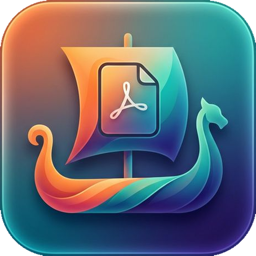

# PDFloki

Native PDF toolkit for macOS.

### [↓ Download the latest release](https://github.com/h3x4d3x4/pdfloki-releases/releases/latest)

macOS 14+ · Apple Silicon &amp; Intel · [pdfloki.app](https://pdfloki.app)

---

PDFloki organizes and processes your entire PDF library — locally and privately. Nothing leaves your Mac.

**Free, forever** — title &amp; metadata management (quick fix, batch edit, find &amp; replace, templates), plus **merge** and **split**.

**Pro** (one-time purchase, no subscription) — compression, OCR, redaction, watermarks &amp; stamps, passwords, signatures, form filling, file conversion, image/CSV/JSON export, and library analysis (duplicates, full-text search, validation).

> This repository hosts the signed, notarized release downloads only — the application source is not included here.
